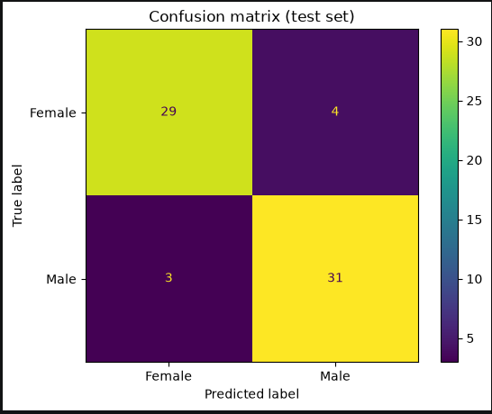
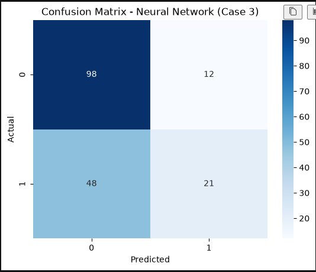
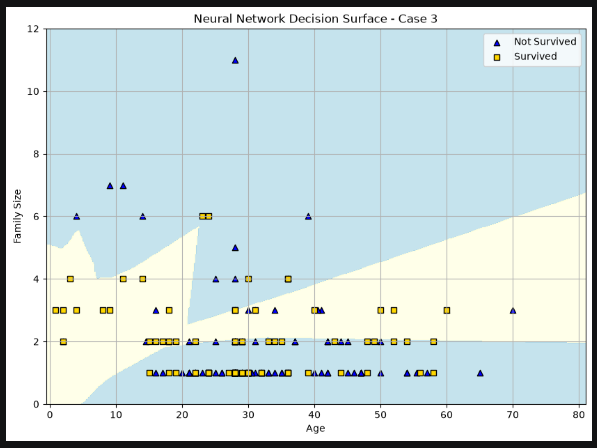

# ml-03-classification

[](https://denisecase.github.io/pro-analytics-02/workflow-b-apply-example-project/)
[](./pyproject.toml)
[](./LICENSE)

> Professional Python project: building and evaluating classification models.

## Project Description

This project focuses on how to build models that predict a category.

We learn to:

- train and evaluate a classifier (e.g., decision tree, logistic regression, k-NN)
- read a confusion matrix and classification report
- interpret accuracy, precision, recall, and F1
- choose a model based on the problem and the data

## Links:

- [ml_03_case.ipynb](notebooks/ml_03_case.ipynb)

## Working Files

You'll work with these areas:

- **data/raw** - raw data for exploration (only if you add a dataset)
- **docs/** - project narrative and documentation
- **src/mlstudio/** - the app is an example; run only (no need to modify)
- **notebooks/** - interactive analysis
- **pyproject.toml** - update authorship & links
- **zensical.toml** - update authorship & links

## Instructions (pro-analytics-02)

Follow the
[step-by-step workflow guide](https://denisecase.github.io/pro-analytics-02/workflow-b-apply-example-project/)
to complete:

1. Phase 1. **Start & Run**
2. Phase 2. **Change Authorship**
3. Phase 3. **Read & Understand**
4. Phase 4. **Modify**
5. Phase 5. **Apply**


## Command Reference

<details>
<summary>Show command reference</summary>

### In a machine terminal (open in your `Repos` folder)

After you get a copy of this repo in your own GitHub account,
open a machine terminal in your `Repos` folder:

```shell
git clone https://github.com/kehummel/ml-03-classification

cd ml-03-classification
code .
```

</details>


## Findings and Visuals

Take screenshots of your charts and provide them here with a discussion.
In Markdown, display a figure by using:
an exclamation mark immediately followed by square brackets containing a useful caption
immediately followed by parentheses containing the relative path to your figure.
Note: When you start typing the path with a dot (.) for "here, in this directory",
the IDE may help complete the path.

In your custom project, follow this example, but

- your figures and narrative should reflect your work,
- this `README.md` should include your commands, process, and visuals, and
- `docs/index.md` should include your narrative.


Gender was determined for penguins based on the following features; flipper length, bill depth, and body mass.



Neural Network: Confusion Matrix and Scatter Plot



## Project Documentation

[Phase 4 Notebook](.notebooks/ml_03_hummel.ipynb)

[Phase 5 Notebook](.notebooks/project03/ml03_hummel.ipynb)

[Phase 5 README](.notebooks/project03/P3_README.md)

[docs/index.md](docs/index.md)

## Citation

[CITATION.cff](./CITATION.cff)

## License

[MIT](./LICENSE)
